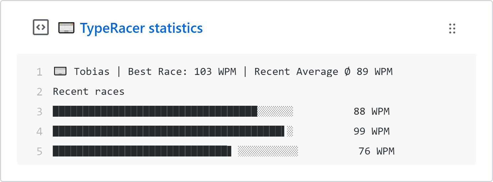

  

  
  
  
  

  📊 Update a pinned gist to contain your latest <a href="https://play.typeracer.com/">TypeRacer</a> races and other typing statistics. ⌨️ 

---
> 📌✨ For more pinned-gist projects like this one, check out: https://github.com/matchai/awesome-pinned-gists

## 🎒 Prep Work
1. Create a new public GitHub Gist (https://gist.github.com/)
2. Create a token with the `gist` scope and copy it. (https://github.com/settings/tokens/new)

## 🖥 Project Setup
1. Fork this repo
2. Go to your fork's `Settings` > `Secrets` > `Add a new secret` for each environment secret (below)

## 🤫 Environment Secrets
- **GIST_ID:** The ID portion from your gist url `https://gist.github.com/<github username>/`**`7887b94cbb97a90fe08498c4744bad4b`**.
- **GH_TOKEN:** The GitHub token generated above.
- **TR_USERNAME:** Your TypeRacer username

## ✨ Credits
This code was heavily inspired (with some parts taken over) by [@jacc's music-box](https://github.com/jacc/music-box/).

## 📄 License

[typeracer-box](https://github.com/tobimori/typeracer-box) is licensed under the [MIT License](https://github.com/tobimori/typeracer-box/blob/master/LICENSE)